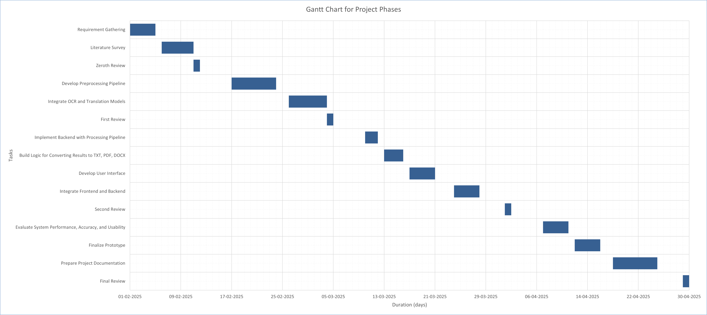

## Project title

An OCR-Based Solution for Digitizing Handwritten Old Documents with Regional Language Translation

| Team Members      | Reg. No.     |
| ----------------- | ------------ |
| Charankumar E G D | 921321205029 |
| Arunprasad S      | 921321205015 |
| Dharani Dharan R  | 921321205032 |

| Mentor                                                                       |
| ---------------------------------------------------------------------------- |
| Mrs. A. Sangeetha, M.E., Ph.D., Assistant Professor - Information Technology |

| Date       |
| ---------- |
| 12/02/2025 |

## Abstract

The digitization of handwritten old documents in regional languages is challenging due to diverse handwriting styles, material degradation, and translation complexities, limiting public access to valuable records. This project proposes an OCR-based system that converts handwritten documents into machine-readable text and translates them into regional languages using advanced OCR and language translation models. Preliminary results show effective handling of handwriting variations and accurate regional translations, offering a promising solution for preserving and enhancing the accessibility of old documents.

## Problem statement

Many old registered documents exist only in handwritten form, making them difficult to access and interpret. Aging, ink fading, and script variations further complicate their readability. Traditional OCR systems struggle with handwritten text, especially in regional languages with complex character shapes.

How might we develop an AI or OCR solution to digitize and convert handwritten, old registered documents into a readable and accessible format in regional languages improving public access and readability of historical records?

## Objective

Utilize advanced OCR to extract text from handwritten old documents, handling various handwriting styles and degraded texts with high accuracy.

Support multiple regional languages for precise text extraction and translation while ensuring context-aware translations that preserve meaning and linguistic nuances.

Apply noise reduction, binarization, and contrast enhancement to improve visibility. Post-processing techniques refine extracted text for better readability and usability.

Safeguard old documents by converting them into machine-readable formats. Enable downloads in PDF, DOCX, and TXT formats for easy storage and sharing.

## Literature survey

| Title                                                                                  | Author(s) & Year                                                                                 | Approach                                                                                                                                                                                                | Limitations                                                                                                                                            | Link                                          |
| -------------------------------------------------------------------------------------- | ------------------------------------------------------------------------------------------------ | ------------------------------------------------------------------------------------------------------------------------------------------------------------------------------------------------------- | ------------------------------------------------------------------------------------------------------------------------------------------------------ | --------------------------------------------- |
| Document Image Analysis for Text Extraction and Translation                            | R. Thendral, G. Sudharsan, M. Subasri, M. K. Ragul - 2024                                        | Uses OCR, neural networks, and machine translation techniques for text extraction and multilingual translation (English-Tamil).                                                                         | Requires high computational resources, struggles with handwritten and low quality scanned documents.                                                   | https://ieeexplore.ieee.org/document/10626260 |
| Handwritten OCR for word in Indic Language using Deep Networks                         | Manish Kumar Gupta, Surya Vikram, Siddharth Dhawan, Atul Kurron - 2023                           | Uses CNN-Transformer architecture with ResNet18 encoder and transformer decoder to recognize handwritten words in 8 Indian languages (Bangla, Gujarati, Gurumukhi, Hindi, Kannada, Odia, Telugu, Urdu). | Tamil and Malayalam not included due to dataset limitations; accuracy may vary across languages.                                                       | https://ieeexplore.ieee.org/document/10117106 |
| Image to Text Recognition for Detecting Human and Machine Altered News in Social Media | Abdullah Kamal, Zaid Jamal, Gabriel Rosales, Brian Robinson, Zachary Satny, Haena Rathore - 2023 | Uses Google Cloud Vision API OCR to extract text from news images, demonstrating high accuracy text extraction and reliability for multilingual document digitization.                                  | Accuracy may be affected by variations in image quality and text distortions.                                                                          | https://ieeexplore.ieee.org/document/10325722 |
| Scan.it Text Recognition, Translation and Conversion                                   | Minal Acharya, Priti Chouhan, Asmita Deshmukh - 2019                                             | A web application using Tesseract OCR for text recognition and ImiTranslator for multilingual translation, focusing on Marathi language recognition.                                                    | Tesseract's accuracy varies significantly for handwritten text; limited to Marathi language; translation accuracy depends on ImTranslator performance. | https://ieeexplore.ieee.org/document/9036818  |

## Key Findings

- Based on the research, Google Vision API emerges as the most effective OCR solution for both printed and handwritten text, overcoming the limitations of Tesseract OCR, CNN, and deep learning-based models.

- Additionally, Google Translate API provides reliable multilingual translation, making it a suitable alternative to ImTranslator.

- To enhance performance, improvements in preprocessing (e.g., noise reduction, binarization, contrast enhancement), workflow optimization (automated text extraction and translation), and post-processing (grammar correction, contextual analysis) will be implemented in this project.

## Gantt chart for project phases

## Thankyou
