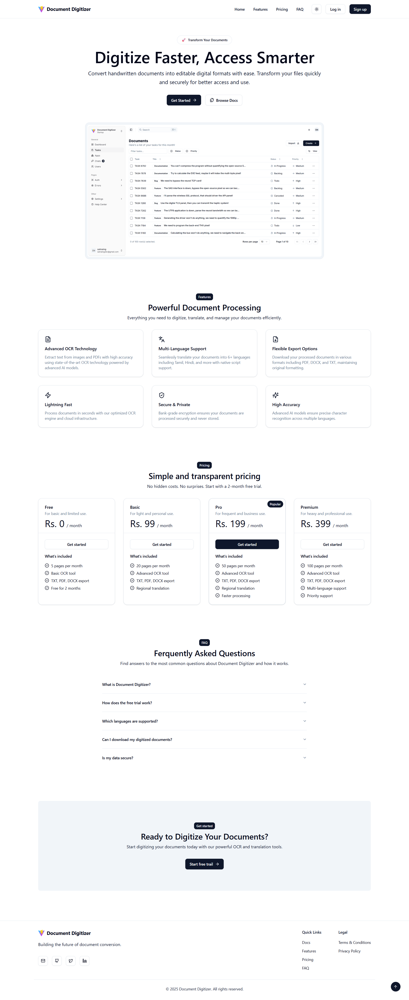
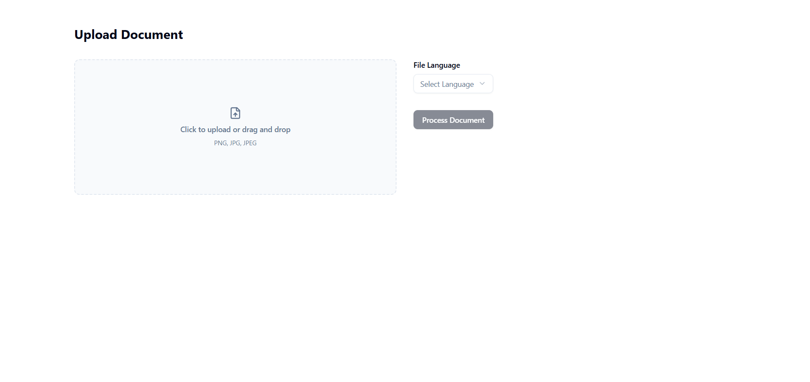
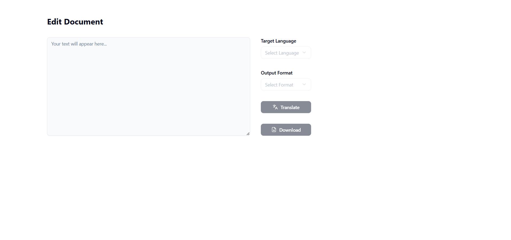
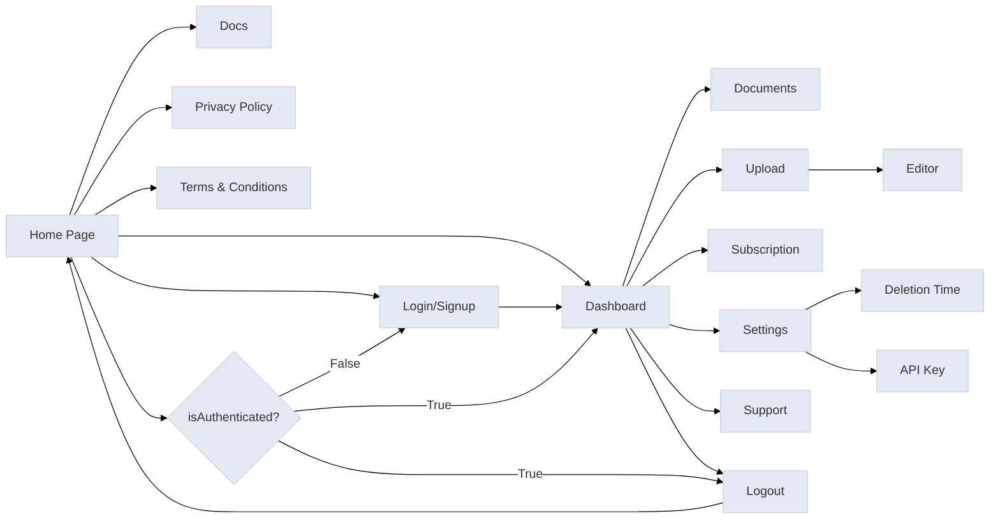

## Project title

An OCR-Based Solution for Digitizing Handwritten Old Documents with Regional Language Translation

| Team Members      | Reg. No.     |
| ----------------- | ------------ |
| Charankumar E G D | 921321205029 |
| Arunprasad S      | 921321205015 |
| Dharani Dharan R  | 921321205032 |

| Mentor                                                                       |
| ---------------------------------------------------------------------------- |
| Mrs. A. Sangeetha, M.E., Ph.D., Assistant Professor - Information Technology |

| Date       |
| ---------- |
| 25/02/2025 |

## Proposed Methodology

- Upload: Users upload handwritten documents (PDF, JPEG, PNG).

- Preprocessing: Enhances quality (Grayscale, Denoising, Normalization, Thresholding, Deskewing).

- OCR Processing: Extracts text using Google Vision API for high accuracy.

- Post-Processing: Cleans, structures, and formats text for better readability.

- Translation: Converts text into English, Tamil, Hindi, Telugu, Malayalam, Kannada.

- Output & Download: Exports processed text as TXT, PDF, Word files.

- Subscription: Free (5 pages/month for 2 months) & Paid (₹99/20 pages, ₹199/50 pages, ₹399/100 pages).

## Prototype

### Home Page

### Upload Page

### Editor Page

## Tools & Frameworks

| Frontend     | Backend          | Authentication & Payments | Other Tools |
| ------------ | ---------------- | ------------------------- | ----------- |
| React.js     | Python           | Clerk                     | Git         |
| TypeScript   | Flask            | Razorpay                  | GitHub      |
| Tailwind CSS | OpenCV           |                           | Postman     |
|              | Google Vision    |                           | PostgreSQL  |
|              | Google Translate |

## Flowchart

## Thankyou
