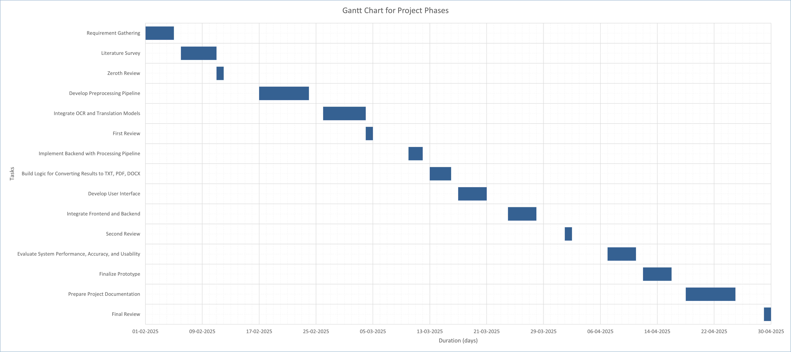

## Project title

An OCR-Based Solution for Digitizing Handwritten Old Documents with Regional Language Translation

| Team Members      | Reg. No.     |
| ----------------- | ------------ |
| Charankumar E G D | 921321205029 |
| Arunprasad S      | 921321205015 |
| Dharani Dharan R  | 921321205032 |

|             |                                            |
| ----------- | ------------------------------------------ |
| Mentor      | Mrs. A. Sangeetha                          |
| Department  | Information Technology                     |
| Institution | PSNA College of Engineering and Technology |
|             |                                            |

## Abstract

The preservation and accessibility of handwritten old documents, particularly those in regional languages, pose significant challenges due to the diversity in handwriting styles, material degradation over time, and the complexities of translating text into regional languages. These challenges limit public access to valuable documents, emphasizing the need for efficient digitization solutions.

This idea presents an Optical Character Recognition (OCR)-based solution aimed at digitizing handwritten, old registered documents and translating them into regional languages. The proposed system utilizes advanced OCR technology to convert scanned images of handwritten records into machine-readable text. Furthermore, a regional language translation model is integrated to ensure the translation of the digitized content into local languages, thereby enhancing public accessibility.

Preliminary results indicate that the OCR system efficiently handles various handwriting styles, while the translation model ensures the generation of region-specific language outputs. This approach offers a promising solution for preserving and making old documents more accessible to a broader audience.

## Problem statement

How might we develop an AI or OCR solution to digitize and convert handwritten, old registered documents into a readable and accessible format in regional languages improving public access and readability of historical records?

## Objective

- Develop an AI-powered OCR system for digitizing handwritten and old registered documents.

- Ensure accurate text recognition across multiple regional languages.

- Enhance document clarity and readability for improved accessibility.

- Preserve historical records by converting them into a machine-readable format.

## Literature survey

| Title                                                                                  | Author(s)                                                                                 | Year | Approach                                                                                                                                                                                                | Limitations                                                                                                                                             | Link                                          |
| -------------------------------------------------------------------------------------- | ----------------------------------------------------------------------------------------- | ---- | ------------------------------------------------------------------------------------------------------------------------------------------------------------------------------------------------------- | ------------------------------------------------------------------------------------------------------------------------------------------------------- | --------------------------------------------- |
| Document Image Analysis for Text Extraction and Translation                            | R. Thendral, G. Sudharsan, M. Subasri, M. K. Ragul                                        | 2024 | Uses OCR, neural networks, and machine translation techniques for text extraction and multilingual translation (English-Tamil).                                                                         | Requires high computational resources, struggles with handwritten and low quality scanned documents.                                                    | https://ieeexplore.ieee.org/document/10626260 |
| Handwritten OCR for word in Indic Language using Deep Networks                         | Manish Kumar Gupta, Surya Vikram, Siddharth Dhawan, Atul Kurron                           | 2023 | Uses CNN-Transformer architecture with ResNet18 encoder and transformer decoder to recognize handwritten words in 8 Indian languages (Bangla, Gujarati, Gurumukhi, Hindi, Kannada, Odia, Telugu, Urdu). | Tamil and Malayalam not included due to dataset limitations; accuracy may vary across languages.                                                        | https://ieeexplore.ieee.org/document/10117106 |
| Image to Text Recognition for Detecting Human and Machine Altered News in Social Media | Abdullah Kamal, Zaid Jamal, Gabriel Rosales, Brian Robinson, Zachary Satny, Haena Rathore | 2023 | Uses Google Cloud Vision API OCR to extract text from news images, demonstrating high accuracy text extraction and reliability for multilingual document digitization.                                  | Accuracy may be affected by variations in image quality and text distortions.                                                                           | https://ieeexplore.ieee.org/document/10325722 |
| Scan.it Text Recognition, Translation and Conversion                                   | Minal Acharya, Priti Chouhan, Asmita Deshmukh                                             | 2019 | A web application using Tesseract OCR for text recognition and ImiTranslator for multilingual translation, focusing on Marathi language recognition.                                                    | Tesseract's accuracy varies significantly for handwritten text; limited to Marathi language; translation accuracy depends on ImiTranslator performance. | https://ieeexplore.ieee.org/document/9036818  |

## Key Findings

- Based on the research, Google Vision API emerges as the most effective OCR solution for both printed and handwritten text, overcoming the limitations of Tesseract OCR, CNN, and deep learning-based models.

- Additionally, Google Translate API provides reliable multilingual translation, making it a suitable alternative to ImTranslator.

- To enhance performance, improvements in preprocessing (e.g., noise reduction, binarization, contrast enhancement), workflow optimization (automated text extraction and translation), and post-processing (grammar correction, contextual analysis) will be implemented in this project.

## Gantt chart for project phases

## Thankyou
